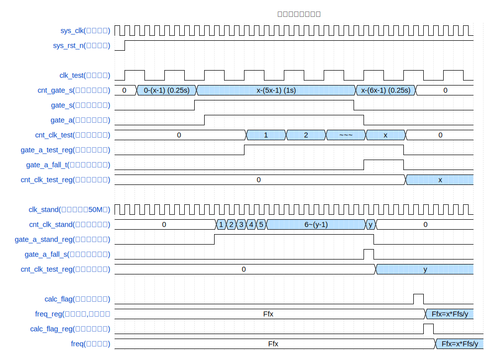

#开发记录
### 说明：

1. 本文档由DuRuofu撰写，由DuRuofu负责解释及执行。

### 修订历史：

|  文档名称  |  版本  |  作者  |      时间      |   备注   |
| ---- | ---- | ------------ | ------ |
| FPGA实现硬件频率计 |v1.0.0| DuRuofu | 2024-02-05 | 首次建立 |
<div STYLE="page-break-after: always;"></div>
# FPGA实现硬件频率计

### 一、概述

频率测量在诸多领域都有广泛的应用，常用的频率测量方法有两种，分别是频率测量 法和周期测量法。 

**频率测量法**：在时间 t 内对被测时钟信号的时钟周期 N 进行计数，然后求出单位时间 内的时钟周期数，即为被测时钟信号的时钟频率。 

**周期测量法**：先测量出被测时钟信号的时钟周期 T，然后根据频率 f = 1／T 求出被测 时钟信号的频率。

但是上述两种方法都会产生±1 个被测时钟周期的误差，在实际应用中有一定的局限 性；而且根据两种方式的测量原理，很容易发现频率测量法适合于测量高频时钟信号，而周期测量法适合于低频时钟信号的测量，但二者都不能兼顾高低频率同样精度的测量要求

等精度测量法与前两种方式不同，其最大的特点是，测量的实际门控时间不是一个固 定值，它与被测时钟信号相关，是被测时钟信号周期的整数倍。在实际门控信号下，同时 对标准时钟和被测时钟信号的时钟周期进行计数，再通过公式计算得到被测信号的时钟频 率。

被测时钟信号的计算方法。
首先我们先分别对实际闸门下被测时钟信号和标准时钟信号的时钟周期进行计数。 实际闸门下被测时钟信号周期数为 X，设被测信号时钟周期为 Tfx，它的时钟频率 fx = 1/Tfx，由此可得等式：X * Tfx = X / fx = Tx(实际闸门)。
实际闸门下标准时钟信号周期数为 Y，设被测信号时钟周期为 Tfs，它的时钟频率 fs = 1/Tfs，由此可得等式：Y * Tfs = Y / fs = Tx(实际闸门)。
其次，将两等式结合得到只包含各自时钟周期计数和时钟频率的等式：X / fx = Y / fs = Tx(实际闸门)，等式变换，得到被测时钟信号时钟频率计算公式：fx = X * fs / Y。
最后，将已知量标准时钟信号时钟频率 fs 和测量量 X、Y 带入计算公式，得到被测时 钟信号时钟频率 fx。
### 二、系统框图

顶层模块：


子功能模块：


整体框图：


### 三、 模块波形图
#### 频率计算模块：freq_meter_calc



### 三、 代码实现

#### 频率计算模块：freq_meter_calc

模块代码：
``` verilog
`timescale 1ns / 1ns

module freq_meter_calc(
    input wire sys_clk,
    input wire sys_rst_n,
    input wire clk_test,

    output reg [31:0] freq
    );
// 参数定义：
parameter CNT_GATE_S_MAX = 27'd74_999_999; //闸门计数器最大值(1.5s)
parameter CNT_RISE_MAX = 27'd12_500_000-1; //闸门计数器最大值(0.25s)
parameter CLK_STAND_FREQ = 27'd100_000_000; //标准参考时钟频率


// 声明变量：
reg  [26:0] cnt_gate_s; //软件闸门计数器
reg gate_s; //软件闸门标志
reg gate_a; //实际闸门标志
reg  [47:0] cnt_clk_test; //软件闸门计数器
reg gate_a_test_reg; //实际闸门标志缓冲（延时一拍）
reg  [47:0] cnt_clk_test_reg; //软件闸门计数器值

reg [47:0] cnt_clk_stand; //标准参考时钟计数器
reg gate_a_stand_reg; //实际闸门标志缓冲（延时一拍）
reg [47:0] cnt_clk_stand_reg; //标准参考时钟计数器值

reg calc_flag; //计算标志
reg calc_flag_reg; //计算标志
reg [63:0] freq_reg; //软件闸门计数器值

wire gate_a_fall_t; //实际闸门下降沿标志(test)
wire gate_a_fall_s; //实际闸门下降沿标志(stand)
wire clk_stand; //标准参考时钟


// 测量X值
// 闸门计数器：
always @(posedge sys_clk or negedge sys_rst_n) begin
    if(~sys_rst_n) begin
        cnt_gate_s <= 28'b0;
    end
    // 清零条件
    else if(cnt_gate_s == CNT_GATE_S_MAX) begin
            cnt_gate_s <= 28'b0;
        end
    else begin
        cnt_gate_s <= cnt_gate_s + 1;
    end
end

// 闸门标志：
always @(posedge sys_clk or negedge sys_rst_n) begin
    if(~sys_rst_n) begin
        gate_s <= 1'b0;
    end
    // 拉高
    else if((cnt_gate_s > CNT_RISE_MAX) && (cnt_gate_s <=CNT_GATE_S_MAX-CNT_RISE_MAX)) begin
        gate_s <= 1'b1;
    end
    // 拉低
    else begin
        gate_s <= 1'b0;
    end
end

// 实际闸门标志：
always @(posedge clk_test or negedge sys_rst_n) begin
    if(~sys_rst_n) begin
        gate_a <= 1'b0;
    end
    else begin
        gate_a <= gate_s;
    end
end

// 软件闸门计数器
always @(posedge clk_test or negedge sys_rst_n) begin
    if(~sys_rst_n) begin
        cnt_clk_test <= 48'b0;
    end
    // 清零条件
    else if(gate_a == 1'b0) begin
        cnt_clk_test <= 48'b0;
    end
    // 计数条件
    else if(gate_a == 1'b1) begin
        cnt_clk_test <= cnt_clk_test + 1;
    end
    else 
        cnt_clk_test <= 48'b0;
end

// 实际闸门标志缓冲（延时一拍）
always @(posedge sys_clk or negedge sys_rst_n) begin
    if(~sys_rst_n) begin
        gate_a_test_reg <= 1'b0;
    end
    else begin
        gate_a_test_reg <= gate_a;
    end
end

// 实际闸门下降沿标志
assign gate_a_fall_t = (gate_a_test_reg == 1'b1) && (gate_a == 1'b0)?1'b1:1'b0;

// 软件闸门计数器值
always @(posedge sys_clk or negedge sys_rst_n) begin
    if(~sys_rst_n) begin
        cnt_clk_test_reg <= 48'd0;
    end
    else if(gate_a_fall_t == 1'b1) begin
        cnt_clk_test_reg <= cnt_clk_test;
    end
end

// 测量Y值
// 实例化倍频模块,产生标准信号
clk_stand clk_stand_inst
(
// Clock out ports
.clk_out1(clk_stand),     // output clk_out1
// Status and control signals
.reset(~sys_rst_n), // input reset
// Clock in ports
.clk_in1(sys_clk));      // input clk_in1

// 标准参考时钟计数器
always @(posedge clk_stand or negedge sys_rst_n) begin
    if(~sys_rst_n) begin
        cnt_clk_stand <= 48'd0;
    end
    else if(gate_a == 1'b0)
        cnt_clk_stand <= 48'd0;
    else if(gate_a == 1'b1) begin
        cnt_clk_stand <= cnt_clk_stand + 1;
    end    
end

// 实际闸门标志缓冲（延时一拍）
always @(posedge clk_stand or negedge sys_rst_n) begin
    if(~sys_rst_n) begin
        gate_a_stand_reg <= 1'b0;
    end
    else begin
        gate_a_stand_reg <= gate_a;
    end
end

// 实际闸门下降沿标志(stand)
assign gate_a_fall_s = (gate_a_stand_reg == 1'b1) && (gate_a == 1'b0)?1'b1:1'b0;

// 标准参考时钟计数器值
always @(posedge clk_stand or negedge sys_rst_n) begin
    if(~sys_rst_n) begin
        cnt_clk_stand_reg <= 48'd0;
    end
    else if(gate_a_fall_s == 1'b1) begin
        cnt_clk_stand_reg <= cnt_clk_stand;
    end
end

// 频率计算标志
always @(posedge sys_clk or negedge sys_rst_n) begin
    if(~sys_rst_n) begin
        calc_flag <= 1'b0;
    end
    else if(cnt_gate_s == CNT_GATE_S_MAX) begin
        calc_flag <= 1'b1;
    end
    else begin
        calc_flag <= 1'b0;
    end
end


// 频率计算
always @(posedge sys_clk or negedge sys_rst_n) begin
    if(~sys_rst_n) begin
        freq_reg <= 32'd0;
    end
    else if(calc_flag == 1'b1) begin
        freq_reg <= (cnt_clk_test_reg * CLK_STAND_FREQ) / cnt_clk_stand_reg;
    end
end

// 计算标志信号缓冲
always @(posedge sys_clk or negedge sys_rst_n) begin
    if(~sys_rst_n) begin
        calc_flag_reg <= 1'b0;
    end
    else begin
        calc_flag_reg <= calc_flag;
    end
end

// 输出频率
always @(posedge sys_clk or negedge sys_rst_n) begin
    if(~sys_rst_n) begin
        freq <= 32'd0;
    end
    else if(calc_flag_reg == 1'b1) begin
        freq <= freq_reg[31:0];
    end
end

endmodule

```

仿真代码：

``` verilog
`timescale 1ns / 1ns

module freq_meter_tb;

reg sys_clk;
reg sys_rst_n;
reg clk_test;

wire [31:0] freq;


// 重置
initial begin
    sys_clk = 0;
    sys_rst_n <= 0;
    #100; // 等待足够的时间以稳定系统
    sys_rst_n <= 1;
    clk_test =1;
end

// 时钟生成
always #10 sys_clk = ~sys_clk;


// 待测信号生成
always #50 clk_test = ~clk_test;

defparam freq_meter_calc.CNT_GATE_S_MAX = 749;
defparam freq_meter_calc.CNT_RISE_MAX = 124;

// 实例化被测模块
freq_meter_calc freq_meter_calc (
    .sys_clk(sys_clk),
    .sys_rst_n(sys_rst_n),
    .clk_test(clk_test),
    .freq(freq)
);
endmodule


```

四、效果


# 参考链接