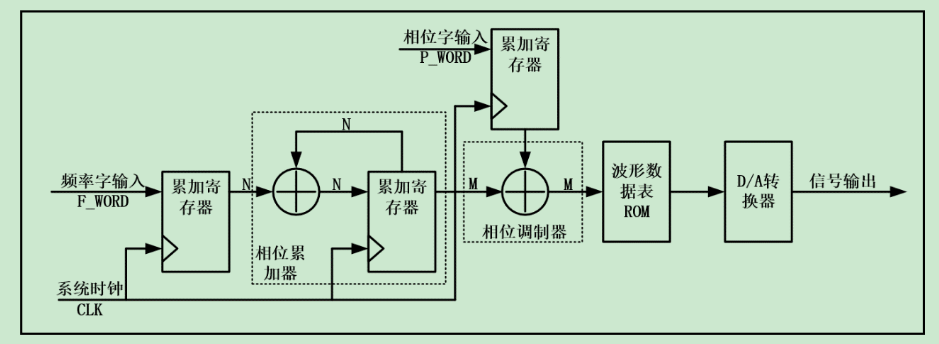
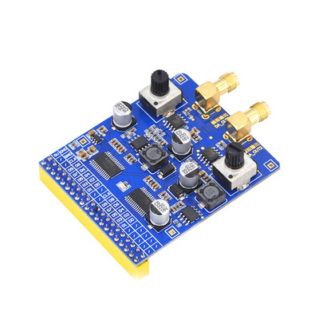
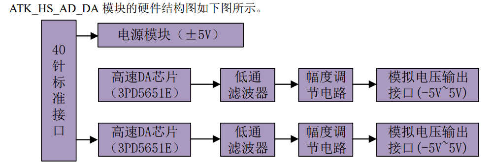
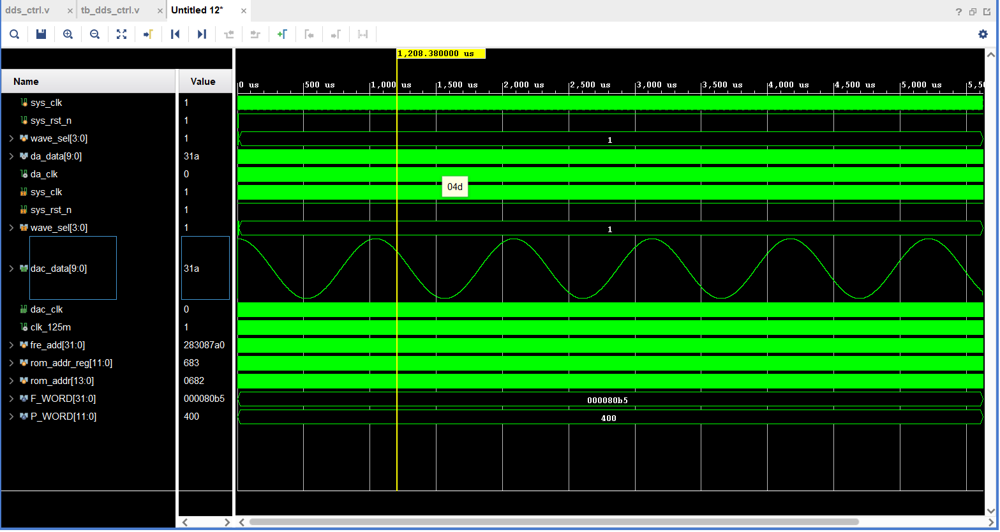

# 简易DDS信号发生器

## 一、原理

### 1. 1 DDS 的基本结构

DDS 的基本结构主要由相位累加器、相位调制器、波形数据表 ROM、D/A 转换器、低通滤波器 等 五大结构组成

## 二、框图

## 三、硬件

**双路高速DA模块3PD5651**

#### 引脚对应：

|   信号名   |  方向  | 管脚 |        端口说明        | 电平标准 |      |
| :--------: | :----: | :--: | :--------------------: | :------: | ---- |
|  sys_clk   | input  |  R4  |    系统时钟，50Mhz     | LVCMOS33 |      |
| sys_rst_n  | input  |  U7  |        系统复位        | LVCMOS33 |      |
|   key[0]   | input  |  T4  |         按键0          | LVCMOS33 |      |
|   key[1]   | input  |  T3  |         按键1          | LVCMOS33 |      |
|   key[2]   | input  |  R6  |         按键2          | LVCMOS33 |      |
|   key[3]   | input  |  T6  |         按键3          | LVCMOS33 |      |
|  dac_clk   | output | E16  | DA（3PD5651E）驱动时钟 | LVCMOS33 |      |
| da_data[0] | output | C18  |     输出给DA的数据     | LVCMOS33 |      |
| da_data[1] | output | C19  |     输出给DA的数据     | LVCMOS33 |      |
| da_data[2] | output | D20  |     输出给DA的数据     | LVCMOS33 |      |
| da_data[3] | output | C20  |     输出给DA的数据     | LVCMOS33 |      |
| da_data[4] | output | B22  |     输出给DA的数据     | LVCMOS33 |      |
| da_data[5] | output | C22  |     输出给DA的数据     | LVCMOS33 |      |
| da_data[6] | output | B21  |     输出给DA的数据     | LVCMOS33 |      |
| da_data[7] | output | A21  |     输出给DA的数据     | LVCMOS33 |      |
| da_data[8] | output | D14  |     输出给DA的数据     | LVCMOS33 |      |
| da_data[9] | output | D15  |     输出给DA的数据     | LVCMOS33 |      |

## 四、软件

dds模块仿真波形;

