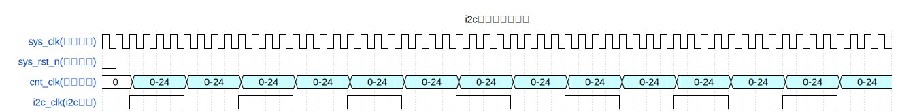
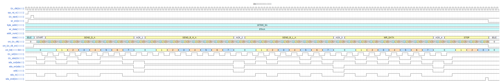
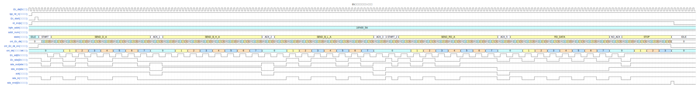

### 说明：

1. 本文档由DuRuofu撰写，由DuRuofu负责解释及执行。
2. 本文档主要介绍使用FPGA实现I2C协议读写AT24C64。

### 修订历史：

|  文档名称  |  版本  |  作者  |      时间      |   备注   |
| ---- | ---- | ------------ | ------ |
| FPGA实现I2C协议读写AT24C64 |v1.0.0| DuRuofu | 2024-02-07 | 首次建立 |
<div STYLE="page-break-after: always;"></div>
# FPGA实现I2C协议读写AT24C64

## 一、 IIC原理

原理方面不再赘述，可参考：[IIC协议解析](../../通讯接口/IIC/IIC协议解析.md)

## 二、 硬件设计


AT24C64 的引脚功能如下： A2,A1,A0：可编程地址输入端。
GND：电源地引脚 
SDA：SDA（Serial Data，串行数据）是双向串行数据输入/输出端。 
SCL：SCL（Serial clock，串行时钟）串行时钟输入端。 
WP（写保护）：AT24C64 有一个写保护引脚用于提供数据保护，当写保护引脚连接至 GND 时，芯片可以正常写，当写保护引脚连接至 VCC 时，使能写保护功能，此时禁止向芯片写入数据，只能进行读操 作。
VCC：电源输入引脚

开发板原理图：


由上图可知，开发板上的 EEPROM 可编程地址 A2、A1、A0 连接到地，所以 AT24C64 的器件地 址为 1010000。


## 三、程序框图

### 3.1 顶层模块：


顶层模块输入输出信号简介：

| 信号 | 位宽 | 类型 | 功能描述 |
| ---- | ---- | ---- | ---- |
| sys_clk | 1Bit | Input | 系统时钟 50MHz |
| sys_rst_n | 1Bit | Input | 复位信号，低有效 |
| key_wr | 1Bit | Input | 写控制按键信号，高有效（1.5V） |
| key_rd | 1Bit | Input | 读控制按键信号，高有效（1.5V） |
| sda | 1Bit | inout | IIC串行数据线 |
| scl | 1Bit | Input | IIC串行时钟线 |
| uart_tx | 1Bit | Input | 串口数据发送 |
### 3.2 子功能模块：

#### 1、按键消抖模块


| 信号名称 | 位宽 | 类型 | 功能描述 |
| ---- | ---- | ---- | ---- |
| sys_clk | 1 | Input | 系统时钟 50MHz |
| sys_rst_n | 1 | Input | 复位信号，低有效 |
| key_in | 1 | Input | 按键的输入 |
| key_flag | 1 | output | 去抖后按键被按下的标志信号 |

#### 2、串口发送及缓冲模块


| 信号名称  | 位宽 | 类型   | 功能描述         |
|:---------:| ---- | ------ | ---------------- |
|  sys_clk  | 1    | Input  | 系统时钟 50MHz   |
| sys_rst_n | 1    | Input  | 复位信号，低有效 |
|  data_in  | 8    | Input  | 发送数据写入     |
|   wr_en   | 1    | Input  | 发送数据写入使能 |
|    tx     | 1    | output | 串口输出         |

用于将从eeprom里读出的输入输出到串口
#### 3、IIC控制模块

I2C 驱动模块的主要功能是按照 I2C 协议对 EERPROM 存储芯片执行数据读写操作


I2C 驱动模块输入输出信号简介

| 信号名称  | 位宽 |  类型  |           功能描述           |
|:---------:|:----:|:------:|:----------------------------:|
|  sys_clk  |  1   | Input  |        系统时钟 50MHz        |
| sys_rst_n |  1   | Input  |       复位信号，低有效       |
|   wr_en   |  1   | Input  |          写使能信号          |
|   rd_en   |  1   | Input  |          读使能信号          |
| i2c_start |  1   | Input  |   单字节数据读/写开始信号    |
| addr_num  |  1   | Input  |  数据存储地址字节数标志信号  |
| byte_addr |  16  | Input  |         数据存储地址         |
|  wr_data  |  8   | Input  |    待写入 EEPROM 字节数据    |
|  i2c_clk  |  1   | Output |           工作时钟           |
|  i2c_end  |  1   | Output |   单字节数据读/写结束信号    |
|  rd_data  |  8   | Output | 自 EEPROM 中读出的单字节数据 |
|  i2c_scl  |  1   | Output |     I2C 串行时钟信号 SCL     |
|  i2c_sda  |  1   | Output |     I2C 串行数据信号 SDA     |

I2C 驱动模块包括 13 路输入输出信号，其中输入信号 8 路、输出信号 5 路。输入信号中，`sys_clk`、`sys_rst_n` 是必不可少的系统时钟和复位信号；
`wr_en`、`rd_en` 为 写使能信号，由数据收发模块生成并传入，高电平有效；
`i2c_start `信号为单字节数据读/写 开始信号；与 i2c_start 信号同时传入的还有数据存储地址 `byte_addr` 和待写入字节数据 `wr_data`；
当写使能 `wr_en` 和 `2c_start` 信号同时有效，模块执行单字节数据写操作，按照数 据存储地址 `byte_addr`，向 `EEPROM` 对应地址写入数据 `wr_data`；
当读使能信号 `rd_en` 和 `i2c_start` 信号同时有效，模块执行单字节数据读操作，按照数据存储地址 `byte_addr` 读取 `EEPROM` 对应地址中的数据；

I2C 设备存储地址有单字节和 2 字节两 种，为了应对这一情况，我们向模块输入 `addr_num` 信号，当信号为低电平时，表示 I2C 设备存储地址为单字节，在进行数据读写操作时只写入数据存储地址 `byte_addr` 的低 8 位；当 信号为高电平时，表示 I2C 设备存储地址为 2 字节，在进行数据读写操作时要写入数据存 储地址 `byte_addr` 的全部 16 位。

`i2c_clk`是本模块的工作时钟，由系统时钟 `sys_clk` 分频而来，它的时钟 频率为串行时钟 i2c_scl 频率的 4 倍，时钟信号 `i2c_clk` 要传入数据收发模块`(i2c_rw_data)`作 为模块的工作时钟；输出给数据收发模块`(i2c_rw_data)` 的单字节数据读/ 写结束信号` i2c_end`，高电平有效，表示一次单字节数据读/写操作完成；`rd_data` 信号表示自 EEPROM 读出的单字节单字节数据，输出至数据收发模块`(i2c_rw_data)`；`i2c_scl`、`i2c_sda` 分别是串 行时钟信号和串行数据信号，由模块产生传入 EEPROM 存储芯片。

#### 4、IIC数据收发模块


数据收发模块的主要功能是：为 I2C 驱动模块提供读/写数据存储地址、待写入数据以 及作为 EEPROM 读出数据缓存，待数据读取完成后将读出数据发送给串口模块进行上位机数据显示。

I2C 数据收发模块输入输出信号简介：

|信号名称|位宽|类型|功能描述|
|---|---|---|---|
|sys_clk|1|Input|系统时钟 50MHz|
|i2c_clk|1|Input|模块工作时钟，频率 1MHz|
|sys_rst_n|1|Input|复位信号，低有效|
|write|1|Input|写触发信号|
|read|1|Input|读触发信号|
|i2c_end|1|Input|单字节数据读/写结束信号|
|rd_data|8|Input|EEPROM 读出数据|
|wr_en|1|Output|写使能信号|
|rd_en|1|Output|读使能信号|
|i2c_start|1|Output|单字节数据读/写开始信号|
|byte_addr|16|Output|读/写数据存储地址|
|wr_data|8|Output|待写入 EEPROM 数据|
|fifo_rd_data|8|Output|读取数据|

### 3.3 整体框图：


## 四、逻辑实现

### 1、按键消抖模块

``` verilog
`timescale  1ns/1ns

// 按键消抖模块 

module  key_filter
#(
    parameter CNT_MAX = 20'd999_999 //计数器计数最大值
)
(
    input   wire    sys_clk     ,   //系统时钟50Mhz
    input   wire    sys_rst_n   ,   //全局复位
    input   wire    key_in      ,   //按键输入信号

    output  reg     key_flag        //key_flag为1时表示消抖后检测到按键被按下
                                    //key_flag为0时表示没有检测到按键被按下
);

//********************************************************************//
//****************** Parameter and Internal Signal *******************//
//********************************************************************//
//reg   define
reg     [19:0]  cnt_20ms    ;   //计数器

//********************************************************************//
//***************************** Main Code ****************************//
//********************************************************************//

//cnt_20ms:如果时钟的上升沿检测到外部按键输入的值为低电平时，计数器开始计数
always@(posedge sys_clk or negedge sys_rst_n)
    if(sys_rst_n == 1'b0)
        cnt_20ms <= 20'b0;
    else    if(key_in == 1'b1)
        cnt_20ms <= 20'b0;
    else    if(cnt_20ms == CNT_MAX && key_in == 1'b0)
        cnt_20ms <= cnt_20ms;
    else
        cnt_20ms <= cnt_20ms + 1'b1;

//key_flag:当计数满20ms后产生按键有效标志位
//且key_flag在999_999时拉高,维持一个时钟的高电平
always@(posedge sys_clk or negedge sys_rst_n)
    if(sys_rst_n == 1'b0)
        key_flag <= 1'b0;
    else    if(cnt_20ms == CNT_MAX - 1'b1)
        key_flag <= 1'b1;
    else
        key_flag <= 1'b0;

endmodule

```


### 2、串口发送及缓冲模块

串口+ fifo缓冲输出：
```   verilog
`timescale 1ns / 1ns

// 串口输出 + 缓冲

module uart_fifo_tx
#(
    parameter UART_BSP = 'd9600,        // 波特率
    parameter CLK_FREQ = 'd50_000_000   // 时钟频率
)
(
    input wire sys_clk,
    input wire sys_rst_n,
    input wire [7:0] data_in, // 串口输出缓冲区输入数据
    input wire wr_en,          // 串口输出缓冲区输入数据标志(写入使能)

    //output wire empty,          // 串口输出缓冲区空标志
    //output wire full,            // 串口输出缓冲区满标志
    output wire tx              // 串口发送数据
);

wire [7:0] data_out;  // 串口输出数据
wire rd_en;
wire empty;

// 缓冲区非空就使能缓冲区数据读出,并且和串口发送模块的写入使能相连
assign rd_en =!empty;

// 实例化UART发送模块
uart_tx
#(
    .UART_BSP(UART_BSP),   // 波特率
    .CLK_FREQ(CLK_FREQ)   // 时钟频率
)
uart_tx
(
    .sys_clk            (sys_clk),        
    .sys_rst_n          (sys_rst_n),      
    .pi_data            (data_out),  
    .pi_flag            (wr_en),

    .tx                 (tx)
);

// 实例化UART发送缓冲
dcfifo_uart_1024x8 dcfifo_uart_1024x8_tx (
  .rst(~sys_rst_n),        // input wire rst
  .wr_clk(sys_clk),  // input wire wr_clk
  .rd_clk(sys_clk),  // input wire rd_clk
  .din(data_in),        // input wire [7 : 0] din
  .wr_en(wr_en),    // input wire wr_en
  .rd_en(rd_en),    // input wire rd_en

  .dout(data_out),      // output wire [7 : 0] dout
  .full(),      // output wire full
  .empty(empty)    // output wire empty
);

endmodule
```

串口实现：

```  verilog
`timescale 1ns / 1ns
module uart_tx
#(
    parameter UART_BSP = 'd9600,        // 波特率
    parameter CLK_FREQ = 'd50_000_000   // 时钟频率
)
(
    input wire          sys_clk,        // 系统时钟
    input wire          sys_rst_n,      // 系统复位信号
    input wire   [7:0]  pi_data,        // 模块输入数据
    input wire          pi_flag,        // 串口输入数据标志

    output reg  tx             // 数据输出
);

parameter BAUD_CNT__MAX = CLK_FREQ/UART_BSP; // 波特率计数器最大值

reg         work_en;  // 工作使能
reg [15:0]  baud_cnt; // 波特计数器
reg         bit_flag; // 数据标志
reg [3:0]   bit_cnt;  // 比特计数器

// 使能信号
always @(posedge sys_clk or negedge sys_rst_n) begin
    if(!sys_rst_n) begin
        work_en <= 1'b0;
    end
    else if(pi_flag == 1'b1) begin
        work_en <= 1'b1;
    end
    else if((bit_cnt == 4'd9) && (bit_flag == 1'b1)) begin
        work_en <= 1'b0;
    end
    else 
        work_en <= work_en;
end

// 波特计数器
always @(posedge sys_clk or negedge sys_rst_n) begin
    if(!sys_rst_n) begin
        baud_cnt <= 16'd0;
    end
    // 归零条件
    else if((work_en == 1'b0) || (baud_cnt == BAUD_CNT__MAX - 1'b1)) begin
        baud_cnt <= 16'd0;
    end
    // 计数条件
    else if(work_en == 1'b1) begin
        baud_cnt <= baud_cnt + 1'b1;
    end
    else 
        baud_cnt <= baud_cnt;
end

// 比特标志信号
always @(posedge sys_clk or negedge sys_rst_n) begin
    if(!sys_rst_n) begin
        bit_flag <= 1'b0;
    end
    else if(baud_cnt == 16'b1) begin
        bit_flag <= 1'b1;
    end
    else begin
        bit_flag <= 1'b0;
    end
end

// 比特计数器
always @(posedge sys_clk or negedge sys_rst_n) begin
    if(!sys_rst_n) begin
        bit_cnt <= 4'd0;
    end
    // 归零条件
    else if((bit_flag == 1'b1) && (bit_cnt == 4'd9)) begin
        bit_cnt <= 4'd0;
    end
    // 计数条件
    else if((bit_flag == 1'b1) && (work_en == 1'b1)) begin
        bit_cnt <= bit_cnt + 1'b1;
    end
    else begin
        bit_cnt <= bit_cnt;
    end

end

// 输出信号
always @(posedge sys_clk or negedge sys_rst_n) begin
    if(!sys_rst_n) begin
        tx <= 1'b1; //空闲为高
    end
    else if(bit_flag == 1'b1)begin
        case(bit_cnt)
            4'd0: tx <= 1'b0; //起始位为低
            4'd1: tx <= pi_data[0];
            4'd2: tx <= pi_data[1];
            4'd3: tx <= pi_data[2];
            4'd4: tx <= pi_data[3];
            4'd5: tx <= pi_data[4];
            4'd6: tx <= pi_data[5];
            4'd7: tx <= pi_data[6];
            4'd8: tx <= pi_data[7];
            4'd9: tx <= 1'b1; //停止位为高
            default: tx <= 1'b1;
        endcase
    end
end

endmodule

```


## 3、IIC控制模块

#### 3.1  IIC控制模块状态转移图


系统上电后，状态机处于 IDLE(初始状态)，接收到有效的单字节数据读/写开始信号 i2c_start 后，状态机跳转到 START_1(起始状态)；FPGA 向 EEPROM 存储芯片发送起始信 号；随后状态机跳转到 SEND_D_ADDR(发送器件地址状态)，在此状态下向 EEPROM 存 储芯片写入控制指令，控制指令高 7 位为器件地址，最低位为读写控制字，写入“0”，表 示执行写操作；控制指令写入完毕后，状态机跳转到 ACK_1(应答状态)。 

在 ACK_1(应答状态)状态下，要根据存储地址字节数进行不同状态的跳转。当 FPGA 接收到 EEPROM 回 传 的 应 答 信 号 且 存 储 地 址 字 节 为 2 字 节 ， 状 态 机 跳 转 到 SEND_B_ADDR_H(发送高字节地址状态)，将存储地址的高 8 位写入 EEPROM，写入完成 后 ， 状 态 机 跳 转 到 ACK_2( 应 答 状 态 ) ；FPGA 接 收 到 应 答 信 号 后 ， 状 态 机 跳 转 到 SEND_B_ADDR_L(发送低字节地址状态)；当 FPGA 接收到 EEPROM 回传的应答信号且存 储地址字节为单字节，状态机状态机直接跳转到 SEND_B_ADDR_L(发送低字节地址状 态)；在此状态低 8 位存储地址或单字节存储地址写入完成后，状态机跳转到 ACK_3(应答 状态)。 

在 ACK_3(应答状态)状态下，要根据读/写使能信号做不同的状态跳转。当 FPGA 接收 到应答信号且写使能信号有效，状态机跳转到 WR_DATA(写数据状态)；在写数据状态， 向 EEPROM 写入单字节数据后，状态机跳转到 ACK_4(应答状态)；待 FPGA 接收到有效应 答信号后，状态机跳转到 STOP(停止状态)；当 FPGA 接收到应答信号且读使能信号有效， 状 态 机 跳 转 到 START_2( 起始状态) ； 再 次 向 EEPROM 写 入 起 始 信 号 ， 状 态 跳 转 到 SEND_RD_ADDR(发送读控制状态)；再次向 EEPROM 写入控制字节，高 7 位器件地址不 变，读写控制位写入“1”，表示进行读操作，控制字节写入完毕后，状态机跳转到 ACK_5(应答状态)；待 FPGA 接收到有效应答信号后，状态机跳转到 RD_DATA(读数据状 态)；在 RD_DATA(读数据状态)状态，EEPROM 向 FPGA 发送存储地址对应存储单元下的 单字节数据，待数据读取完成户，状态机跳转到 N_ACK(无应答状态)，在此状态下向 EEPROM 写入一个时钟的高电平，表示数据读取完成，随后状态机跳转到 STOP(停止状 态)。

在 STOP(停止状态)状态，FPGA 向 EEPROM 发送停止信号，一次单字节数据读/写操 作 完 成 ， 随 后 状 态 机 跳 回 IDLE( 初 始 状 态 )， 等 待 下 一 次 单 字 节 数 据 读 /写 开 始 信 号 i2c_start。

#### 3.2  IIC控制模块波形图

计数器分频产生i2c时钟，频率1MHZ：



写数据波形：



读数据波形：
 
#### 3.2  IIC控制模块代码实现 

1、模块代码：
``` verilog


```
# 参考链接

1. https://www.bilibili.com/video/BV13L4y1b7So/?spm_id_from=333.788.top_right_bar_window_history.content.click&vd_source=ef5a0ab0106372751602034cdd9ab98e
2. 

